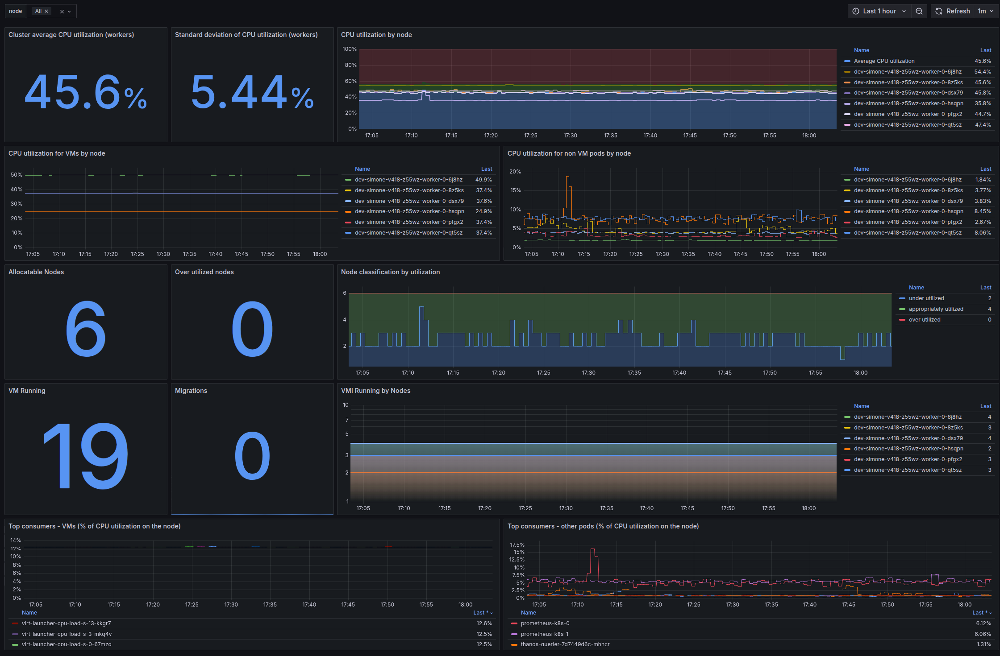

# Deploying a custom grafana dashboard to monitor Load Aware ReBalancing

A custom grafana dashboard can be deployed to monitor Load Aware ReBalancing.

## Example



## Dashboard

The Load Aware ReBalancing dashboard shows:
- Cluster average CPU utilization (workers)
- Standard deviation of CPU utilization (workers)
- CPU utilization by node
- CPU utilization for VMs by node
- CPU utilization for non VM pods by node
- Allocatable Nodes
- Over utilized nodes
- Node classification by utilization
- VM Running
- Migrations
- VMI Running by Nodes
- Top consumers - VMs (% of CPU utilization on the node)
- Top consumers - other pods (% of CPU utilization on the node)

The dashboard can be filtered to focus on a subset of the worker nodes.

## Deployment

1. Follow the preliminary steps on [Monitor OpenShift Virtualization using user-defined projects and Grafana](https://developers.redhat.com/articles/2024/08/19/monitor-openshift-virtualization-using-user-defined-projects-and-grafana) to configure your cluster to expose custom grafana dashboard.

2. Create an additional Grafana dashboard object:
```bash
cat <<EOF > grafana-dashboard-ocp-v-lab.yaml
apiVersion: grafana.integreatly.org/v1beta1
kind: GrafanaDashboard
metadata:
  name: grafana-dashboard-ocp-v-lab
  labels:
    app: grafana
spec:
  instanceSelector:
    matchLabels:
      dashboards: grafana  
  folder: "Openshift Virtualization"      
  url: https://raw.githubusercontent.com/openshift-virtualization/descheduler-psi-evaluation/refs/heads/main/monitoring/json/load_aware_rebalancing.json
EOF
oc -n openshift-user-workload-monitoring create -f grafana-dashboard-ocp-v-lab.yaml
```

## Usage

Connect to your grafana instance.
an additional dashboard named `Load Aware ReBalancing` should appear under `OpenShift Virtualization` folder. 